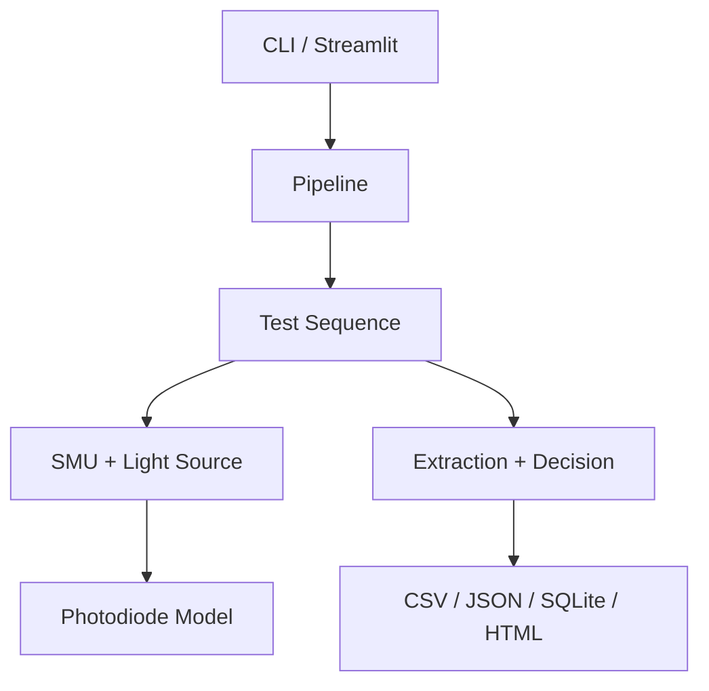

# 系统架构

```mermaid
flowchart TD
    UI[CLI / Streamlit] --> P[Pipeline]
    P --> S[Test Sequence]
    S --> I[SMU + Light Source]
    I --> D[Photodiode Model]
    S --> A[Extraction + Decision]
    A --> O[CSV / JSON / SQLite / HTML]
```

依赖方向始终由入口指向业务层和接口层。真实硬件接入时，用 `VisaSMU` 替换 `SimulatedSMU`，DUT 模型不再参与测量；分析、判定、存储和报告保持不变。当前 `VisaSMU` 的 SCPI 指令只是通用骨架，必须结合具体型号编程手册验证。
